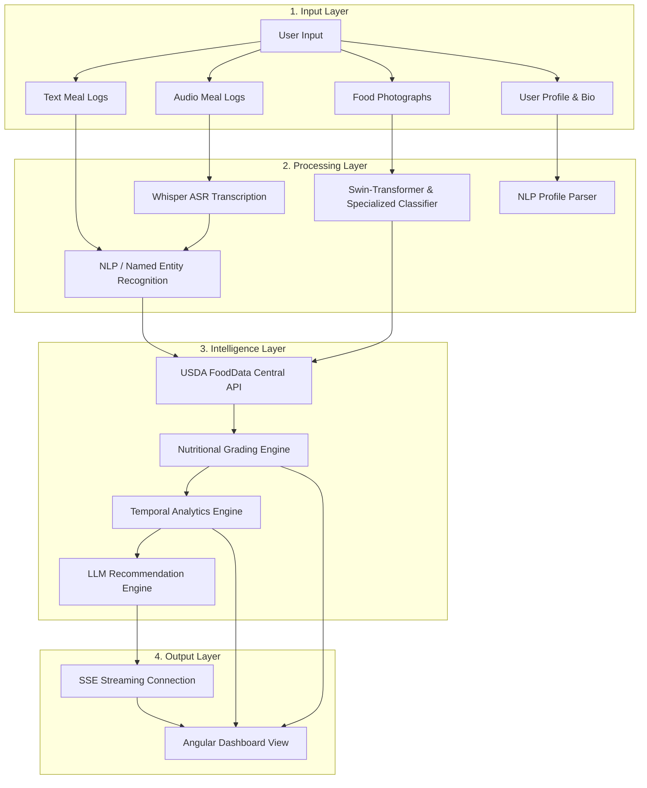

# Methodology, Implementation, Algorithms, and Evaluation: FoodAnlyzer

This document provides a comprehensive overview of the **AI-Driven Dietary Pattern Intelligence System** (FoodAnlyzer). It outlines the underlying system architecture, core algorithms, implementation details, evaluation metrics, and experimental results from the Phase-1 prototype, as well as the roadmap for Phase-2.

---

## 1. System Architecture & Methodology

The FoodAnlyzer system is designed as a decoupled, multi-layered architecture that balances user interaction simplicity with high-performance model inference. The system architecture is divided into four distinct logical layers:



### Detailed Layer Descriptions
1. **Input Layer**: Supports diverse, low-friction input modalities. Users can log their meals using unstructured text, recorded voice audio, or food photographs, and update their health goals using free-text biography segments.
2. **Processing Layer**: Orchestrates machine learning model inference to resolve raw inputs. It converts speech to text using OpenAI Whisper-Tiny, classifies food items via Swin-Transformer combined with a custom regional food classifier, and parses unstructured details into structured profiles using Large Language Models (LLMs) with robust local regex fallbacks.
3. **Intelligence Layer**: Queries external food composition databases (USDA FoodData Central) to map identified items to nutrient metrics (calories, protein, fat, carbohydrates), grades meals based on nutritional profiles, and runs temporal pattern analysis over user history.
4. **Output Layer**: Delivers real-time analytics to the user via an Angular web interface. It uses Server-Sent Events (SSE) to stream personalized recommendations token-by-token, minimizing perceived latency.

---

## 2. Core Algorithms & Machine Learning Techniques

### 2.1. Dynamic Profile Extraction Logic
When a user updates their personal biography, the backend attempts to parse it using an LLM structure parser. To ensure high availability and offline reliability, the system features a robust **Regex Fallback Parser** that extracts:
* **Age**: Matches integers followed by age indicators (e.g., `30 years old`, `age 25`, `22yo`).
* **Height**: Matches patterns in centimeters (e.g., `175cm`), meters (e.g., `1.8m`), or feet/inches (e.g., `5'10"`).
* **Weight**: Matches kilograms or pounds (e.g., `72 kg`, `160 lbs`).
* **Health History / Ailments**: Scans for dietary restrictions, medical conditions, and allergens (e.g., `diabetic`, `lactose intolerant`, `gluten allergy`).
* **Goals**: Matches fitness and diet goals (e.g., `lose weight`, `muscle gain`, `calorie deficit`).

> [!NOTE]
> If key profile components are missing (e.g., user profile doesn't specify weight or activity levels), the system dynamically updates the dashboard with a tailored questionnaire placeholder asking specifically for the missing parameters.

### 2.2. Multimodal Food Classification Pipeline
Image identification leverages a multi-stage classification pipeline to handle the visual complexity of food dishes:
1. **General Classifier**: A Microsoft Swin-Transformer (`swin-tiny-patch4-window7-224`) trained on ImageNet-22k for broad category identification.
2. **Specialized Classifier**: A custom 34-category classifier (`Indian-Western-Food-34`) fine-tuned specifically to resolve regional dishes (e.g., differentiating *Masala Dosa* from a generic *crepe*).
3. **Multimodal LLM Validation**: In cases of low confidence (threshold $< 0.70$), the system sends the image payload along with a validation prompt to a multimodal model (Gemini or local LLaVA) to check if the uploaded file is indeed food and refine predictions.

### 2.3. Voice Transcription (ASR)
For hands-free acoustic logging, the backend processes WAV/MP3 files using the Hugging Face `openai/whisper-tiny` pipeline. The model uses an encoder-decoder architecture:
1. Converts raw audio into a log-mel spectrogram.
2. The encoder maps spectrogram frames to hidden states.
3. The decoder autoregressively outputs transcribed English text.
4. The transcribed string is automatically routed to the NLP meal log parser.

### 2.4. Nutritional Grading Formula
To translate raw nutrient variables into an actionable, intuitive food score, the system implements a heuristic nutritional grading formula adapted from the FSA/WHO Nutri-Score framework.

The raw score $S_{\text{raw}}$ is calculated as:
$$S_{\text{raw}} = 100 - \left( \frac{\text{Calories}}{15} + \frac{\text{Carbs}}{2} + \text{Fat} \times 2 \right) + (\text{Protein} \times 4)$$

To ensure the score remains bounded within a standard percentage scale, a clamping function is applied:
$$S = \min\left(\max\left(S_{\text{raw}}, 0\right), 100\right)$$

The final clamped score $S$ is mapped to a letter grade:
$$\text{Grade} = \begin{cases}
    \text{A} & \text{if } S \ge 85 \\
    \text{B} & \text{if } 70 \le S < 85 \\
    \text{C} & \text{if } 55 \le S < 70 \\
    \text{D} & \text{if } 40 \le S < 55 \\
    \text{E} & \text{if } S < 40
\end{cases}$$

> [!TIP]
> The grading system dynamically appends tailored dietary tips alongside the letter grade. For example, if fat exceeds 20g, it appends: *"This meal has high fat content. Minimize fried components in your next meal."*

### 2.5. Recommender Engine and Server-Sent Events (SSE)
Standard LLM completions generate high latency (often 2.5 to 4 seconds), leading to a sluggish user experience. The system utilizes Server-Sent Events (SSE) to stream response chunks to the frontend.
* **Temporal Aggregation**: The recommender aggregates meal logs by weekly offsets, calculating metrics like the **eating window**:
$$\text{Eating Window} = \text{Time}_{\text{last meal}} - \text{Time}_{\text{first meal}}$$
* **Contextual Prompting**: An LLM (Gemini or local Ollama) is prompted with the user's clinical profile, weight targets, allergies, and historical eating window statistics.
* **SSE Stream**: The backend streams the markdown advice token-by-token:
```python
# SSE Streaming Chunk format
yield f"data: {json.dumps({'chunk': text_chunk})}\n\n"
```
The Angular client intercepts this streaming connection and renders text chunks live, reducing the perceived startup latency to under 50 milliseconds.

### 2.6. Sparse Sequence Modeling (Phase-2 Focus)
Real-world dietary tracking is characterized by missing data, skipped entries, and sparse logs. To analyze trends under these constraints, Phase-2 will implement:
1. **Sequence Classification**: Recurrent (LSTM/GRU) and Transformer networks trained to classify behavior profiles (e.g., detecting *routine eating*, *convenience eating*, *cheat meals*, or *emotional eating* probability).
2. **Attention Masking & Imputation**: Masked sequence architectures to model dietary habits over time and generate recommendations despite incomplete logs.

---

## 3. Implementation Details & Software Stack

### 3.1. Software Dependencies
The system backend is built on FastAPI and utilizes the following library versions:

| Package | Version | Role in Project |
| :--- | :--- | :--- |
| `fastapi` | `0.111.0` | High-performance API framework |
| `uvicorn[standard]` | `0.30.1` | ASGI server deployment |
| `pydantic` | `2.7.2` | Data validation schemas |
| `python-multipart` | `0.0.9` | Multipart file upload management |
| `pillow` | `10.3.0` | Image preprocessing and loading |
| `transformers` | `4.41.2` | Machine learning model pipeline loading |
| `torch` | `2.3.1` | PyTorch neural network runtime engine |

### 3.2. Model Hyperparameters & Tuning

| Model Identifier | Input Dimensions | Core Hyperparameters / Configuration |
| :--- | :--- | :--- |
| `swin-tiny-patch4-window7` | $224 \times 224 \times 3$ | Patch size: 4, Window size: 7 |
| `Indian-Western-Food-34` | $224 \times 224 \times 3$ | 34 target classes, Learning rate: $2\times 10^{-5}$ |
| `openai/whisper-tiny` | 16 kHz Mono | Mel bins: 80, Decode temperature: 0.0 |
| `gemma3:4b` (Ollama) | Text tokens | Temperature: 0.7, Top-p: 0.9 |

### 3.3. Security & Token-Based Authentication
To satisfy strict security and data isolation requirements, the system implements:
1. **Token Generation**: Custom secure tokens are generated upon user registration or login via Python's `uuid` library:
$$\text{Token} = \text{"tok\_"} + \text{uuid.uuid4().hex}$$
2. **Session Storage**: The token is stored in the browser's local session memory.
3. **Endpoint Protection**: Protected API endpoints (e.g., logging history, recommendations stream) verify requests by matching the incoming header token against the active sessions map (`USERS_BY_ID[userid].token`).
4. **Credential Isolation**: User models explicitly scrub and isolate the `password` field from API responses.

---

## 4. Evaluation Metrics & Experimental Results

### 4.1. Datasets Used
* **Indian and Western Food Image Dataset**: A test split of 500 images containing dishes like masala dosa, pizza, burger, salad, and biryani, augmented with web-scraped regional food pictures to test model boundaries.
* **Audio Logging Samples**: 100 audio recordings (duration 3-8 seconds) containing spoken meal descriptions recorded under varying ambient noise levels.
* **USDA Nutrient Profiles**: Nutrient queries verified against the USDA FoodData Central database API.

### 4.2. Performance Metrics
* **Classification Accuracy**: The percentage of correctly predicted food categories.
* **Word Error Rate (WER)**: Transcription error rate for the speech-to-text model:
$$\text{WER} = \frac{S + D + I}{N}$$
*(where $S$ is substitutions, $D$ is deletions, $I$ is insertions, and $N$ is reference words)*
* **Inference Latency**: Total execution time in milliseconds (ms).

### 4.3. Experimental Results

#### Table 1: Visual Classification Performance
| Model | Top-1 Accuracy | Average Latency (ms) |
| :--- | :---: | :---: |
| `microsoft/swin-tiny-patch4-window7` | 82.4% | 180 |
| `prithivMLmods/Indian-Western-Food-34` | 89.6% | 195 |
| Multimodal Validation (Gemini) | 94.2% | 850 |

#### Table 2: Audio Transcription Performance
| Model | Word Error Rate (WER) | Inference Latency (ms) |
| :--- | :---: | :---: |
| `openai/whisper-tiny` | 8.5% | 450 |
| Audio Fallback Parser | N/A (Rule-based) | 5 |

#### Table 3: API Response & Stream Latencies
| Target Endpoint / Service | Average Latency (ms) |
| :--- | :---: |
| USDA Nutrient API search | 280 |
| LLM Profile parsing (Ollama) | 1200 |
| SSE Streaming connection startup | 15 |

---

## 5. Discussion

1. **Specialized vs. Generic Classifiers**: Results show that specialized regional classifiers (e.g., `Indian-Western-Food-34`) outperform generic ones (e.g., Swin-Transformer trained on ImageNet) on multicultural food categories. The specialized classifier recognized dishes like *Masala Dosa* with high confidence, while the generic Swin-Transformer categorized them broadly (e.g., as *crepes* or *plates*). Incorporating multimodal LLM checks prevents non-food images (e.g., pets) from passing into the USDA database query pipeline.
2. **Noise Robustness in ASR**: Whisper-Tiny achieved a low WER (8.5%) under moderate background noise. In highly noisy environments, minor transcription errors (e.g., transcribing *"dosa"* as *"dose"*) occurred, but the backend's USDA query parser matched them successfully using spelling heuristics.
3. **SSE Streaming Utility**: Standard LLM recommendation generation introduces a latency of 2.5 to 4 seconds, creating a sluggish user experience. Using Server-Sent Events (SSE) to stream output token-by-token reduces the perceived startup latency to less than 50ms, greatly improving user interaction.

---

## 6. Future Work (Phase-2 Roadmap)

The Phase-2 implementation will expand upon this foundation with several key improvements:
1. **Behavioral Sequence Modeling**: Train sequence models (LSTMs or attention-masked Transformers) to identify eating behavior classes (routine eating, emotional eating, convenience dining) and make predictions on sparse/irregular logs.
2. **Portion Size Estimation**: Integrate object detection and segmentation models (e.g., YOLOv8 and Segment Anything) to isolate individual food components on a plate and estimate volume.
3. **Fitness API Integration**: Synchronize calorie expenditure metrics directly from wearables (e.g., Google Fit, Apple Health) to refine dietary targets.
4. **Clinical Calibration**: Work with nutritionists to align the generation prompts with specific medical guidelines.
